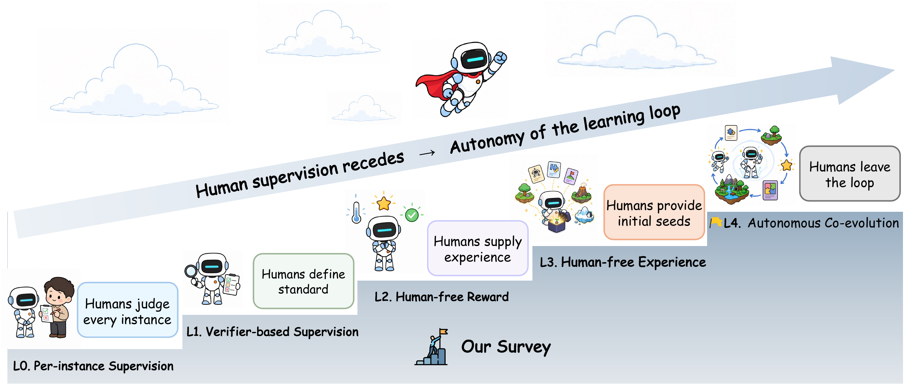
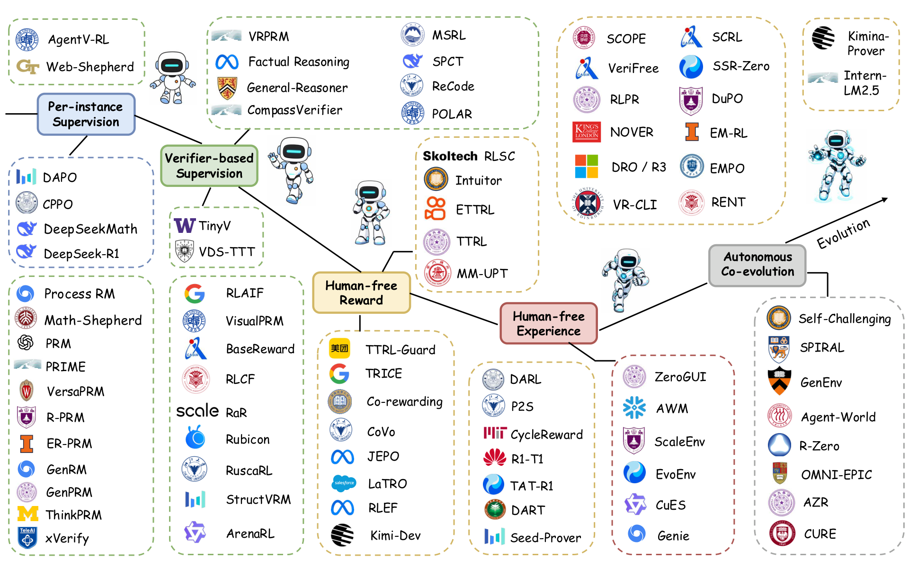

# Awesome-Scaling-LRM-Beyond-Human-Supervision

[](https://awesome.re)
[](https://github.com/visitworld123/Awesome-Scaling-LRM-Beyond-Verifiable-Truths)
[](https://github.com/visitworld123/Awesome-Scaling-LRM-Beyond-Verifiable-Truths)
[](#-citation)
[](https://github.com/visitworld123/Awesome-Scaling-LRM-Beyond-Verifiable-Truths/pulls)

> Companion repository for the survey  
> **Scaling Large Reasoning Models beyond Human Supervision: A Path toward Superintelligence**

A curated list of papers, code, and benchmarks from the survey, organized by the **receding-supervision ladder (L0 → L4)**.

---

## 📢 News

- **2026-08** Expanded coverage to survey papers across **L0–L4**, and added **Figure 1** (receding-supervision ladder).
- Contributions welcome — place each work under its **primary** ladder level.

---

## 📖 Figure 1 · Receding-Supervision Ladder

<p align="center">
  
</p>

<p align="center"><em>Figure 1 from the survey: as human supervision recedes, autonomy of the learning loop increases (L0 → L4).</em></p>

| Level | Reward | Experience | Humans still govern |
|:-----:|--------|------------|---------------------|
| **L0** | human (per instance) | human | judgment of every instance |
| **L1** | reusable verifier | human | standard of judgment |
| **L2** | **human-free** | human | supply of experience only |
| **L3** | human-free | **human-free** | only initial seeds |
| **L4** | human-free | human-free | **nothing** — closed co-evolution |

<p align="center">
  
</p>

<p align="center"><em>Survey landscape figure: representative milestones along the five-level progression.</em></p>

---

## 📑 Table of Contents

- [L0 · Per-instance Supervision](#l0--per-instance-supervision-reference)
- [L1 · Verifier-based Supervision](#l1--verifier-based-supervision)
- [L2 · Human-free Reward](#l2--human-free-reward)
- [L3 · Human-free Experience](#l3--human-free-experience)
- [L4 · Autonomous Co-evolution](#l4--autonomous-co-evolution)
- [Evaluation](#evaluation-datasets-and-benchmarks)
- [Future Directions](#challenges-and-future-directions)
- [Contributing](#-contributing)
- [Citation](#-citation)

---

## L0 · Per-instance Supervision (Reference)

> Humans judge **every** training instance (answers or preferences). Starting point of the ladder.

- DeepSeekMath: Pushing the Limits of Mathematical Reasoning in Open Language Models
  <a href="https://arxiv.org/pdf/2402.03300?"></a>
  <a href="https://github.com/deepseek-ai/DeepSeek-Math"></a>
  <a href="https://github.com/deepseek-ai/DeepSeek-Math"></a>
- DeepSeek-R1: Incentivizing Reasoning Capability in LLMs via Reinforcement Learning
  <a href="https://arxiv.org/pdf/2501.12948?"></a>
  <a href="https://github.com/deepseek-ai/DeepSeek-R1"></a>
  <a href="https://github.com/deepseek-ai/DeepSeek-R1"></a>
- Training Language Models to Follow Instructions with Human Feedback (InstructGPT / RLHF)
  <a href="https://arxiv.org/pdf/2203.02155?"></a>
- Let's Verify Step by Step (MATH / process supervision)
  <a href="https://arxiv.org/pdf/2305.20050?"></a>
  <a href="https://github.com/openai/prm800k"></a>
  <a href="https://github.com/openai/prm800k"></a>
- Welcome to the Era of Experience *(Silver & Sutton; experience-era thesis)*

---

## L1 · Verifier-based Supervision

> Humans no longer label every rollout; they provide a **reusable verifier** (LLM judge / reward model). Tasks & environments remain human-supplied.

### LLM as a Verifier

- Crossing the Reward Bridge: Expanding RL with Verifiable Rewards Across Diverse Domains
  <a href="https://arxiv.org/pdf/2503.23829?"></a>
  <a href="https://huggingface.co/collections/virtuoussy/rlvr-67ea349b086e3511f86d1c1f"></a>
- Continuous Self-Improvement of LLMs by Test-time Training with Verifier-Driven Sample Selection (VDS-TTT)
  <a href="https://arxiv.org/pdf/2505.19475?"></a>
- SSR-Zero: Simple Self-Rewarding Reinforcement Learning for Machine Translation
  <a href="https://arxiv.org/pdf/2505.16637?"></a>
  <a href="https://github.com/Kelaxon/SSR-Zero"></a>
  <a href="https://github.com/Kelaxon/SSR-Zero"></a>
  <a href="https://huggingface.co/collections/wjyccs/ssr-zero-6830189a8d2fd6fc7ce6fba6"></a>
- Omni-Thinker: Scaling Cross-Domain Generalization via Multi-Task RL with Hybrid Rewards
  <a href="https://arxiv.org/pdf/2507.14783?"></a>
- Learning to Reason for Factuality
  <a href="https://arxiv.org/pdf/2508.05618?"></a>
- Checklists Are Better Than Reward Models for Aligning Language Models (RLCF)
  <a href="https://arxiv.org/pdf/2507.18624?"></a>
  <a href="https://github.com/viswavi/RLCF"></a>
  <a href="https://github.com/viswavi/RLCF"></a>
- Rubrics as Rewards: Reinforcement Learning Beyond Verifiable Domains (RaR)
  <a href="https://arxiv.org/pdf/2507.17746?"></a>
- Reinforcement Learning with Rubric Anchors (Rubicon)
  <a href="https://arxiv.org/pdf/2508.12790?"></a>
- Breaking the Exploration Bottleneck: Rubric-Scaffolded RL (RuscaRL)
  <a href="https://arxiv.org/pdf/2508.16949?"></a>
  <a href="https://github.com/IANNXANG/RuscaRL"></a>
  <a href="https://github.com/IANNXANG/RuscaRL"></a>
- Kimi K2: Open Agentic Intelligence
  <a href="https://arxiv.org/pdf/2507.20534?"></a>
  <a href="https://github.com/MoonshotAI/Kimi-K2"></a>
  <a href="https://github.com/MoonshotAI/Kimi-K2"></a>
- Baichuan-M2: Scaling Medical Capability with Large Verifier System
  <a href="https://arxiv.org/pdf/2509.02208?"></a>
  <a href="https://github.com/baichuan-inc/Baichuan-M2-32B"></a>
  <a href="https://github.com/baichuan-inc/Baichuan-M2-32B"></a>
- Self-Rewarding Language Models
  <a href="https://arxiv.org/pdf/2401.10020?"></a>
- Meta-Rewarding Language Models: Self-Improving Alignment with LLM-as-a-Meta-Judge
  <a href="https://arxiv.org/pdf/2407.19594?"></a>
- Self-Taught Evaluators
  <a href="https://arxiv.org/pdf/2408.02666?"></a>
- Process-based Self-Rewarding Language Models
  <a href="https://arxiv.org/pdf/2503.03746?"></a>

### Reward Model as a Verifier

- Seed1.5-Thinking: Advancing Superb Reasoning Models with Reinforcement Learning
  <a href="https://arxiv.org/pdf/2504.13914?"></a>
- General-Reasoner: Advancing LLM Reasoning Across All Domains
  <a href="https://arxiv.org/pdf/2505.14652?"></a>
  <a href="https://github.com/TIGER-AI-Lab/General-Reasoner"></a>
  <a href="https://github.com/TIGER-AI-Lab/General-Reasoner"></a>
  <a href="https://huggingface.co/collections/TIGER-Lab/general-reasoner-67fe9386e43e046489eac013"></a>
- StructVRM: Aligning Multimodal Reasoning with Structured and Verifiable Reward Models
  <a href="https://arxiv.org/pdf/2508.05383?"></a>
- Inference-Time Scaling for Generalist Reward Modeling (SPCT)
  <a href="https://arxiv.org/pdf/2504.02495?"></a>
- Writing-Zero: Bridge the Gap Between Non-verifiable Problems and Verifiable Rewards
  <a href="https://arxiv.org/pdf/2506.00103?"></a>
- Pre-Trained Policy Discriminators are General Reward Models (POLAR)
  <a href="https://arxiv.org/pdf/2507.05197?"></a>
  <a href="https://github.com/InternLM/POLAR"></a>
  <a href="https://github.com/InternLM/POLAR"></a>
  <a href="https://huggingface.co/collections/internlm/polar-68693f829d2e83ac5e6e124a"></a>
- Beyond the Trade-off: Self-Supervised RL for Reasoning Models' Instruction Following
  <a href="https://arxiv.org/pdf/2508.02150?"></a>
  <a href="https://github.com/Rainier-rq/verl-if"></a>
  <a href="https://github.com/Rainier-rq/verl-if"></a>
- EvolvR: Self-Evolving Pairwise Reasoning for Story Evaluation
  <a href="https://arxiv.org/pdf/2508.06046?"></a>
  <a href="https://github.com/xindaaW/EvolvR"></a>
  <a href="https://github.com/xindaaW/EvolvR"></a>
- Posterior-GRPO: Rewarding Reasoning Processes in Code Generation
  <a href="https://arxiv.org/pdf/2508.05170?"></a>
- ReasonFlux-PRM: Trajectory-Aware PRMs for Long CoT Reasoning
  <a href="https://arxiv.org/pdf/2506.18896?"></a>
  <a href="https://github.com/Gen-Verse/ReasonFlux"></a>
  <a href="https://github.com/Gen-Verse/ReasonFlux"></a>
  <a href="https://huggingface.co/collections/Gen-Verse/reasonflux-coder-6833109ed9300c62deb32c6b"></a>
- Math-Shepherd: Verify and Reinforce LLMs Step-by-step without Human Annotations
  <a href="https://arxiv.org/pdf/2312.08935?"></a>
- Process Reinforcement through Implicit Rewards (PRIME)
  <a href="https://arxiv.org/pdf/2502.01456?"></a>
  <a href="https://github.com/PRIME-RL/PRIME"></a>
  <a href="https://github.com/PRIME-RL/PRIME"></a>

---

## L2 · Human-free Reward

> No online human judgment / preference verifier. Reward from **intrinsic signals**, **consensus**, **reference likelihood**, or **environment outcomes**. Humans still supply tasks & environments.

### Intrinsic Certainty

- The Unreasonable Effectiveness of Entropy Minimization in LLM Reasoning (EM-RL)
  <a href="https://arxiv.org/pdf/2505.15134?"></a>
  <a href="https://github.com/shivamag125/EM_PT"></a>
  <a href="https://github.com/shivamag125/EM_PT"></a>
- Right Question is Already Half the Answer: Fully Unsupervised LLM Reasoning Incentivization (EMPO)
  <a href="https://arxiv.org/pdf/2504.05812?"></a>
  <a href="https://github.com/QingyangZhang/EMPO"></a>
  <a href="https://github.com/QingyangZhang/EMPO"></a>
  <a href="https://huggingface.co/collections/qingyangzhang/empo-67f9f7ad7817ebff4b664010"></a>
- Maximizing Confidence Alone Improves Reasoning (RENT)
  <a href="https://arxiv.org/pdf/2505.22660?"></a>
  <a href="https://github.com/satrams/rent-rl"></a>
  <a href="https://github.com/satrams/rent-rl"></a>
- Confidence Is All You Need: Few-Shot RL Fine-Tuning of Language Models (RLSC)
  <a href="https://arxiv.org/pdf/2506.06395?"></a>
- Learning to Reason without External Rewards (Intuitor)
  <a href="https://arxiv.org/pdf/2505.19590?"></a>
  <a href="https://github.com/sunblaze-ucb/Intuitor"></a>
  <a href="https://github.com/sunblaze-ucb/Intuitor"></a>
  <a href="https://huggingface.co/collections/sunblaze-ucb/intuitor-684f895c78ed2d3ef3a678b3"></a>
- No Free Lunch: Rethinking Internal Feedback for LLM Reasoning
  <a href="https://arxiv.org/pdf/2506.17219?"></a>
- Shop-R1: Rewarding LLMs to Simulate Human Behavior in Online Shopping via RL
  <a href="https://arxiv.org/pdf/2507.17842?"></a>

### Consensus

- Co-Rewarding: Stable Self-supervised RL for Eliciting Reasoning in LLMs
  <a href="https://arxiv.org/pdf/2508.00410?"></a>
  <a href="https://github.com/tmlr-group/Co-rewarding"></a>
  <a href="https://github.com/tmlr-group/Co-rewarding"></a>
- TTRL: Test-Time Reinforcement Learning
  <a href="https://arxiv.org/pdf/2504.16084?"></a>
  <a href="https://github.com/PRIME-RL/TTRL"></a>
  <a href="https://github.com/PRIME-RL/TTRL"></a>
- Unsupervised Post-Training for Multi-Modal LLM Reasoning via GRPO (MM-UPT)
  <a href="https://arxiv.org/pdf/2505.22453?"></a>
  <a href="https://github.com/waltonfuture/MM-UPT"></a>
  <a href="https://github.com/waltonfuture/MM-UPT"></a>
- Consistent Paths Lead to Truth: Self-Rewarding RL for LLM Reasoning (CoVo)
  <a href="https://arxiv.org/pdf/2506.08745?"></a>
  <a href="https://github.com/sastpg/CoVo"></a>
  <a href="https://github.com/sastpg/CoVo"></a>
- ETTRL: Balancing Exploration and Exploitation in LLM Test-Time RL via Entropy
  <a href="https://arxiv.org/pdf/2508.11356?"></a>
- Can Large Reasoning Models Self-Train?
  <a href="https://arxiv.org/pdf/2505.21444?"></a>

### Reference-Implicit Signals

- Reinforcing General Reasoning without Verifiers (VeriFree)
  <a href="https://arxiv.org/pdf/2505.21493?"></a>
  <a href="https://github.com/sail-sg/VeriFree"></a>
  <a href="https://github.com/sail-sg/VeriFree"></a>
  <a href="https://huggingface.co/collections/zhouxiangxin/verifree-685a1e9509d0db2ed9731c62"></a>
- Beyond Verifiable Rewards: Scaling RL for Language Models to Unverifiable Data (JEPO)
  <a href="https://arxiv.org/pdf/2503.19618?"></a>
- Language Models Are Hidden Reasoners (LaTRO)
  <a href="https://arxiv.org/pdf/2411.04282?"></a>
  <a href="https://github.com/SalesforceAIResearch/LaTRO"></a>
  <a href="https://github.com/SalesforceAIResearch/LaTRO"></a>
- Direct Reasoning Optimization (DRO)
  <a href="https://arxiv.org/pdf/2506.13351?"></a>
- RLPR: Extrapolating RLVR to General Domains without Verifiers
  <a href="https://arxiv.org/pdf/2506.18254?"></a>
  <a href="https://github.com/OpenBMB/RLPR"></a>
  <a href="https://github.com/OpenBMB/RLPR"></a>
- NOVER: Incentive Training via Verifier-Free Reinforcement Learning
  <a href="https://arxiv.org/pdf/2505.16022?"></a>
  <a href="https://github.com/thinkwee/NOVER"></a>
  <a href="https://github.com/thinkwee/NOVER"></a>
  <a href="https://huggingface.co/collections/thinkwee/novereason-68937ca75331dfaddaf24016"></a>
- Learning to Reason for Long-Form Story Generation (VR-CLI)
  <a href="https://arxiv.org/pdf/2503.22828?"></a>
  <a href="https://github.com/Alex-Gurung/ReasoningNCP"></a>
  <a href="https://github.com/Alex-Gurung/ReasoningNCP"></a>

### Grounded Outcome Signals

Environment-adjudicated rewards (code tests, search, games) without online human labels — still L2 when tasks/envs are fixed.

- RLEF: Grounding Code LLMs in Execution Feedback with Reinforcement Learning
  <a href="https://arxiv.org/pdf/2410.02089?"></a>
- Search-R1: Training LLMs to Reason and Leverage Search Engines with RL
  <a href="https://arxiv.org/pdf/2503.09516?"></a>
  <a href="https://github.com/PeterGriffinJin/Search-R1"></a>
  <a href="https://github.com/PeterGriffinJin/Search-R1"></a>
- R1-Searcher: Incentivizing the Search Capability in LLMs via RL
  <a href="https://arxiv.org/pdf/2503.05592?"></a>
  <a href="https://github.com/RUCAIBox/R1-Searcher"></a>
  <a href="https://github.com/RUCAIBox/R1-Searcher"></a>

---

## L3 · Human-free Experience

> The **experience stream** (tasks and/or environments) is no longer human-designed. Humans provide at most seeds.  
> Includes L2→L3 transitions (task-side or environment-side withdrawal).

### Task Generation (Fixed Environment)

- STaR: Bootstrapping Reasoning with Reasoning
  <a href="https://arxiv.org/pdf/2203.14465?"></a>
  <a href="https://github.com/ezelikman/STaR"></a>
  <a href="https://github.com/ezelikman/STaR"></a>
- Self-Instruct: Aligning Language Models with Self-Generated Instructions
  <a href="https://arxiv.org/pdf/2212.10560?"></a>
  <a href="https://github.com/yizhongw/self-instruct"></a>
  <a href="https://github.com/yizhongw/self-instruct"></a>
- WizardLM / Evol-Instruct: Empowering LLMs to Follow Complex Instructions
  <a href="https://arxiv.org/pdf/2304.12244?"></a>
  <a href="https://github.com/nlpxucan/WizardLM"></a>
  <a href="https://github.com/nlpxucan/WizardLM"></a>
- SeRL: Self-Play Reinforcement Learning for LLMs with Limited Data
  <a href="https://arxiv.org/pdf/2505.20347?"></a>
  <a href="https://github.com/wantbook-book/SeRL"></a>
  <a href="https://github.com/wantbook-book/SeRL"></a>
- CoT-Self-Instruct: Building High-Quality Synthetic Prompts
  <a href="https://arxiv.org/pdf/2507.23751?"></a>
- Beyond the Trade-off: Self-Supervised RL for Instruction Following
  <a href="https://arxiv.org/pdf/2508.02150?"></a>
  <a href="https://github.com/Rainier-rq/verl-if"></a>
  <a href="https://github.com/Rainier-rq/verl-if"></a>
- Self-Questioning Language Models (SQLM)
  <a href="https://arxiv.org/pdf/2508.03682?"></a>
  <a href="https://github.com/lili-chen/self-questioning-lm"></a>
  <a href="https://github.com/lili-chen/self-questioning-lm"></a>
- Multi-Agent Evolve: LLM Self-Improve through Co-evolution (MAE)
  <a href="https://arxiv.org/pdf/2510.23595?"></a>
- Socratic-Zero: Bootstrapping Reasoning via Data-Free Agent Co-evolution
  <a href="https://arxiv.org/pdf/2509.24726?"></a>
- G-Zero: Self-Play for Open-Ended Generation from Zero Data
  <a href="https://arxiv.org/pdf/2605.09959?"></a>
- SPICE: Self-Play In Corpus Environments Improves Reasoning
  <a href="https://arxiv.org/pdf/2510.24684?"></a>
- OpenSIR: Open-Ended Self-Improving Reasoner
  <a href="https://arxiv.org/pdf/2511.00602?"></a>
- AgentSynth: Scalable Task Generation for Generalist Computer-Use Agents
  <a href="https://arxiv.org/pdf/2506.14205?"></a>
  <a href="https://github.com/sunblaze-ucb/AgentSynth"></a>
  <a href="https://github.com/sunblaze-ucb/AgentSynth"></a>

### Environment Construction & Agentic Experience

- ZeroGUI: Automating Online GUI Learning at Zero Human Cost
  <a href="https://arxiv.org/pdf/2505.23762?"></a>
  <a href="https://github.com/OpenGVLab/ZeroGUI"></a>
  <a href="https://github.com/OpenGVLab/ZeroGUI"></a>
  <a href="https://huggingface.co/collections/OpenGVLab/zerogui-68388cb7dbf608133c4b5fb2"></a>
- SEAgent: Self-Evolving Computer Use Agent with Autonomous Learning from Experience
  <a href="https://arxiv.org/pdf/2508.04700?"></a>
  <a href="https://github.com/SunzeY/SEAgent"></a>
  <a href="https://github.com/SunzeY/SEAgent"></a>
- MemAgent: Reshaping Long-Context LLM with Multi-Conv RL-based Memory Agent
  <a href="https://arxiv.org/pdf/2507.02259?"></a>
  <a href="https://github.com/BytedTsinghua-SIA/MemAgent"></a>
  <a href="https://github.com/BytedTsinghua-SIA/MemAgent"></a>
- Voyager: An Open-Ended Embodied Agent with Large Language Models
  <a href="https://arxiv.org/pdf/2305.16291?"></a>
  <a href="https://github.com/MineDojo/Voyager"></a>
  <a href="https://github.com/MineDojo/Voyager"></a>
- Eureka: Human-Level Reward Design via Coding Large Language Models
  <a href="https://arxiv.org/pdf/2310.12931?"></a>
  <a href="https://github.com/eureka-research/Eureka"></a>
  <a href="https://github.com/eureka-research/Eureka"></a>
- Genie: Generative Interactive Environments
  <a href="https://arxiv.org/pdf/2402.15391?"></a>
- PAIRED: Emergent Complexity and Zero-shot Transfer via Unsupervised Environment Design
  <a href="https://arxiv.org/pdf/2012.02096?"></a>
- Agent World Model: Infinity Synthetic Environments for Agentic RL
  <a href="https://arxiv.org/pdf/2602.10090?"></a>
  <a href="https://github.com/Snowflake-Labs/agent-world-model"></a>
  <a href="https://github.com/Snowflake-Labs/agent-world-model"></a>
- ScaleEnv: Scaling Environment Synthesis from Scratch for Generalist Tool-Use Agents
  <a href="https://arxiv.org/pdf/2602.06820?"></a>
- CuES: Curiosity-driven and Environment-grounded Synthesis for Agentic RL
  <a href="https://arxiv.org/pdf/2512.01311?"></a>
  <a href="https://github.com/modelscope/AgentEvolver"></a>
  <a href="https://github.com/modelscope/AgentEvolver"></a>
- EvoEnv: Self-Evolving Reasoning RL via Verifiable Environment Synthesis
  <a href="https://arxiv.org/pdf/2605.14392?"></a>
- Don't Just Fine-tune the Agent, Tune the Environment
  <a href="https://arxiv.org/pdf/2510.10197?"></a>
  <a href="https://github.com/inclusionAI/AWorld-RL"></a>
  <a href="https://github.com/inclusionAI/AWorld-RL"></a>

---

## L4 · Autonomous Co-evolution

> Reward, tasks, and environments **co-evolve** in a closed loop. Includes L3→L4 precursors highlighted in the survey.

- Absolute Zero: Reinforced Self-Play Reasoning with Zero Data (AZR)
  <a href="https://arxiv.org/pdf/2505.03335?"></a>
  <a href="https://github.com/LeapLabTHU/Absolute-Zero-Reasoner"></a>
  <a href="https://github.com/LeapLabTHU/Absolute-Zero-Reasoner"></a>
- R-Zero: Self-Evolving Reasoning LLM from Zero Data
  <a href="https://arxiv.org/pdf/2508.05004?"></a>
  <a href="https://github.com/Chengsong-Huang/R-Zero"></a>
  <a href="https://github.com/Chengsong-Huang/R-Zero"></a>
- Language Self-Play For Data-Free Training (LSP)
  <a href="https://arxiv.org/pdf/2412.16720?"></a>
- Co-Evolving LLM Coder and Unit Tester via Reinforcement Learning (CURE)
  <a href="https://arxiv.org/pdf/2506.03136?"></a>
  <a href="https://github.com/Gen-Verse/CURE"></a>
  <a href="https://github.com/Gen-Verse/CURE"></a>
- Self-Challenging Language Model Agents
  <a href="https://arxiv.org/pdf/2506.01716?"></a>
- SPIRAL: Self-Play on Zero-Sum Games Incentivizes Reasoning via Multi-Agent Multi-Turn RL
  <a href="https://arxiv.org/pdf/2506.24119?"></a>
  <a href="https://github.com/spiral-rl/spiral"></a>
  <a href="https://github.com/spiral-rl/spiral"></a>
- POET: Paired Open-Ended Trailblazer
  <a href="https://arxiv.org/pdf/1901.01753?"></a>
  <a href="https://github.com/uber-research/poet"></a>
  <a href="https://github.com/uber-research/poet"></a>
- OMNI-EPIC: Open-endedness via Models of Human Notions of Interestingness with Environments Programmed in Code
  <a href="https://arxiv.org/pdf/2405.15568?"></a>
  <a href="https://github.com/MaxenceFaldor/Omni-EPIC"></a>
  <a href="https://github.com/MaxenceFaldor/Omni-EPIC"></a>
- GenEnv: Difficulty-Aligned Co-Evolution Between LLM Agents and Environment Simulators
  <a href="https://arxiv.org/pdf/2512.19682?"></a>
  <a href="https://github.com/Gen-Verse/GenEnv"></a>
  <a href="https://github.com/Gen-Verse/GenEnv"></a>
- Agent-World: Scaling Real-World Environment Synthesis for Evolving General Agent Intelligence
  <a href="https://arxiv.org/pdf/2604.18292?"></a>
- Darwin Gödel Machine: Open-Ended Evolution of Self-Improving Agents
  <a href="https://arxiv.org/pdf/2505.22954?"></a>
  <a href="https://github.com/jennyzzt/dgm"></a>
  <a href="https://github.com/jennyzzt/dgm"></a>

---

## Evaluation, Datasets and Benchmarks

### Capability — Hard-verifiable

**Math:** GSM8K ([2110.14168](https://arxiv.org/pdf/2110.14168?)) · MATH/MATH500 ([2305.20050](https://arxiv.org/pdf/2305.20050?)) · LiveMathBench ([2412.13147](https://arxiv.org/pdf/2412.13147?)) · NuminaMath/AMC ([2410.01271](https://arxiv.org/pdf/2410.01271?)) · [AIME 2024](https://artofproblemsolving.com/wiki/index.php/2024_AIME_I) · [AIME 2025](https://artofproblemsolving.com/wiki/index.php/2025_AIME_I) · RandomCalculation ([2507.10532](https://arxiv.org/pdf/2507.10532?))

**Code:** MBPP ([2108.07732](https://arxiv.org/pdf/2108.07732?)) · LiveCodeBench ([2403.07974](https://arxiv.org/pdf/2403.07974?)) · CRUXEval ([2401.03065](https://arxiv.org/pdf/2401.03065?)) · HumanEval ([2107.03374](https://arxiv.org/pdf/2107.03374?)) · CodeContests ([2203.07814](https://arxiv.org/pdf/2203.07814?)) · MHPP ([2405.11430](https://arxiv.org/pdf/2405.11430?)) · CodeElo ([2501.01257](https://arxiv.org/pdf/2501.01257?))

**Logic / Multi-choice:** ZebraLogic ([2502.01100](https://arxiv.org/pdf/2502.01100?)) · AutoLogi ([2502.16906](https://arxiv.org/pdf/2502.16906?)) · Sudoku-Bench ([2505.16135](https://arxiv.org/pdf/2505.16135?)) · AQuA ([1705.04146](https://arxiv.org/pdf/1705.04146?)) · CodeMMLU ([2410.01999](https://arxiv.org/pdf/2410.01999?)) · LogiQA ([2007.08124](https://arxiv.org/pdf/2007.08124?))

### Capability — Semi-verifiable / Expert / Open-ended

GPQA ([2311.12022](https://arxiv.org/pdf/2311.12022?)) · HLE ([2501.14249](https://arxiv.org/pdf/2501.14249?)) · MMLU ([2009.03300](https://arxiv.org/pdf/2009.03300?)) · MMLU-Pro ([2406.01574](https://arxiv.org/pdf/2406.01574?)) · CommonsenseQA ([1811.00937](https://arxiv.org/pdf/1811.00937?)) · CHARM ([2403.14112](https://arxiv.org/pdf/2403.14112?)) · MedQA ([2009.13081](https://arxiv.org/pdf/2009.13081?)) · MedBullets ([2402.18060](https://arxiv.org/pdf/2402.18060?)) · MedXpertQA ([2501.18362](https://arxiv.org/pdf/2501.18362?)) · FinanceQA ([2501.18062](https://arxiv.org/pdf/2501.18062?)) · FinTextQA ([2405.09980](https://arxiv.org/pdf/2405.09980?)) · FinBen ([2402.12659](https://arxiv.org/pdf/2402.12659?)) · FinanceBench ([2311.11944](https://arxiv.org/pdf/2311.11944?)) · LawBench ([2309.16289](https://arxiv.org/pdf/2309.16289?)) · LexEval ([2409.20288](https://arxiv.org/pdf/2409.20288?)) · LegalBench ([2308.11462](https://arxiv.org/pdf/2308.11462?)) · LEXam ([2505.12864](https://arxiv.org/pdf/2505.12864?)) · LitBench ([2507.00769](https://arxiv.org/pdf/2507.00769?)) · CS4 ([2410.04197](https://arxiv.org/pdf/2410.04197?)) · SS-GEN ([2406.15695](https://arxiv.org/pdf/2406.15695?)) · AlpacaEval ([2404.04475](https://arxiv.org/pdf/2404.04475?)) · IFEval ([2311.07911](https://arxiv.org/pdf/2311.07911?)) · MT-Bench ([2306.05685](https://arxiv.org/pdf/2306.05685?)) · EQ-Bench ([2312.06281](https://arxiv.org/pdf/2312.06281?)) · ToMBench ([2402.15052](https://arxiv.org/pdf/2402.15052?)) · EgoSocialArena ([2410.06195](https://arxiv.org/pdf/2410.06195?)) · SocialEval ([2506.00900](https://arxiv.org/pdf/2506.00900?))

### Reward-Axis Benchmarks

- MLLM-as-a-Judge
  <a href="https://arxiv.org/pdf/2402.04788?"></a>
  <a href="https://github.com/Dongping-Chen/MLLM-Judge"></a>
  <a href="https://github.com/Dongping-Chen/MLLM-Judge"></a>
- Judging the Judges: Position Bias in LLM-as-a-Judge
  <a href="https://arxiv.org/pdf/2406.07791?"></a>
- JudgeBench
  <a href="https://arxiv.org/pdf/2410.12784?"></a>
  <a href="https://github.com/ScalerLab/JudgeBench"></a>
  <a href="https://github.com/ScalerLab/JudgeBench"></a>
- JETTS
  <a href="https://arxiv.org/pdf/2504.15253?"></a>
  <a href="https://github.com/SalesforceAIResearch/jetts-benchmark"></a>
  <a href="https://github.com/SalesforceAIResearch/jetts-benchmark"></a>
- CodeJudgeBench
  <a href="https://arxiv.org/pdf/2507.10535?"></a>
  <a href="https://github.com/hongcha0/CodeJudgeBench"></a>
  <a href="https://github.com/hongcha0/CodeJudgeBench"></a>
- RewardBench
  <a href="https://arxiv.org/pdf/2403.13787?"></a>
  <a href="https://github.com/allenai/reward-bench"></a>
  <a href="https://github.com/allenai/reward-bench"></a>
- RM-Bench
  <a href="https://arxiv.org/pdf/2410.16184?"></a>
  <a href="https://github.com/THU-KEG/RM-Bench"></a>
  <a href="https://github.com/THU-KEG/RM-Bench"></a>
- ViLBench
  <a href="https://arxiv.org/pdf/2503.20271?"></a>
  <a href="https://github.com/UCSC-VLAA/ViLBench"></a>
  <a href="https://github.com/UCSC-VLAA/ViLBench"></a>
- Socratic-PRMBench
  <a href="https://arxiv.org/pdf/2505.23474?"></a>
  <a href="https://github.com/Xiang-Li-oss/Socratic-PRMBench"></a>
  <a href="https://github.com/Xiang-Li-oss/Socratic-PRMBench"></a>
- RewardBench 2
  <a href="https://arxiv.org/pdf/2506.01937?"></a>
  <a href="https://github.com/allenai/reward-bench"></a>
  <a href="https://github.com/allenai/reward-bench"></a>
- RewardAnything
  <a href="https://arxiv.org/pdf/2506.03637?"></a>
  <a href="https://github.com/WisdomShell/RewardAnything"></a>
  <a href="https://github.com/WisdomShell/RewardAnything"></a>

---

## Challenges and Future Directions

- **L1–L2:** judge bias, reward hacking, consensus traps, reference under-specification  
- **L3–L4:** difficulty miscalibration, co-adaptive hacking, distributional narrowing, non-stationarity  
- Open: efficient experience sampling; folding verifier-free signals into next-generation pre-training  

---

## 🤝 Contributing

1. Assign a **primary level (L0–L4)**.
2. Prefer the badge format used above (`arxiv` / `github` / `stars`).
3. PR note: one sentence on why that ladder level.

See [CONTRIBUTING.md](CONTRIBUTING.md).

---

## 📜 Citation

```bibtex
@article{yang2026scaling,
  title   = {Scaling Large Reasoning Models beyond Human Supervision: A Path toward Superintelligence},
  author  = {Yang, Zhiqin and Fu, Jingwen and Liu, Yuhan and Liu, Hengyu and Zhang, Yonggang and Cao, Kainan and Zhang, Zizhuo and Li, Chenxin and Yuan, Ruibin and Pan, Jiahao and Sun, Jiankai and Lin, Yunlong and Zhang, Zhenyuan and Xiong, Jing and Li, Yibo and Lin, Sida and Xue, Wei and Han, Bo and Guo, Yike},
  year    = {2026},
  note    = {Survey; companion repository: https://github.com/visitworld123/Awesome-Scaling-LRM-Beyond-Verifiable-Truths}
}
```

---

## ⭐ Star History

[](https://star-history.com/#visitworld123/Awesome-Scaling-LRM-Beyond-Verifiable-Truths&Date)
